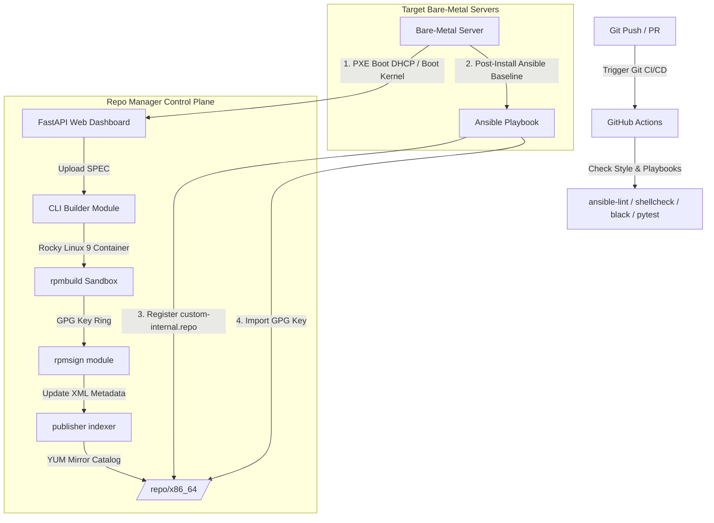

# Automated Bare-Metal Provisioning & Repository Manager

A complete, production-ready infrastructure automation framework that fully orchestrates **bare-metal OS provisioning baselines** (via Ansible), manages the **compilation, GPG-signing, and publishing of custom enterprise RPM packages** (via Python APIs), and enforces stability using a **Git-driven CI/CD configuration management pipeline**.

An interactive, high-fidelity **administrative control plane dashboard** is included to monitor active PXE provisioning logs and package deployment pipelines in real-time.

---

## Key Features

- **Bare-Metal Operating System Baselines**: Comprehensive Ansible playbooks automating system timezone/NTP setups, kernel variables hardening, firewalld policies, and secured SSH profiles (key-only authentication).
- **Custom RPM Packaging Suite**: Python-based APIs and CLI tools to build packages from SPEC files, manage GPG private/public key rings, sign packages, and publish them to local directories.
- **YUM/DNF Mirror Publisher**: Automates local repository index and metadata updates (`repomd.xml`, `primary.xml.gz`) via `createrepo` (or standard fallback XML catalog builders).
- **Git-driven CI/CD Pipeline**: GitHub Actions workflows validating Ansible playbook syntax (`ansible-lint`), shell script styling (`shellcheck`), Python syntax and formatting rules (`flake8`, `black`), and running pytest unit tests.
- **Control Plane UI Dashboard**: Sleek developer dashboard implementing FastAPI, modern glassmorphic panels, glowing metrics cards, dynamic compilation states, and streamed bare-metal PXE installation log outputs.

---

## System Architecture



---

## Project Structure

```
├── .ansible-lint                     # Ansible linter configuration rules
├── .gitignore                        # Git ignore rules
├── pyproject.toml                    # Python metadata and tool dependencies
├── requirements.txt                  # Python dependencies
├── .github/
│   └── workflows/
│       └── ci.yml                    # GitHub Actions CI/CD pipeline definition
├── ansible/
│   ├── inventory.ini                 # Target bare-metal hosts configuration
│   ├── site.yml                      # Master entry point playbook
│   ├── group_vars/
│   │   └── all.yml                   # System baselines global variables
│   └── roles/
│       ├── baseline/                 # NTP/Timezones, package setup, sysctl tuning
│       ├── security/                 # SSH access hardening, firewall rules
│       └── repo_client/              # Repository mirrors registry, GPG key import
├── scripts/
│   ├── Dockerfile.builder            # Containerized RPM compilation sandbox image
│   ├── run_ci.sh                     # Local validation validation check pipeline
│   └── setup_gpg.sh                  # Non-interactive GPG key ring setup automation
└── src/
    ├── repo_manager/
    │   ├── api.py                    # FastAPI server for mirrors and status dashboard
    │   ├── builder.py                # RPM compiler module (Local / Container)
    │   ├── cli.py                    # Click-based CLI entry point
    │   ├── publisher.py              # Repository index database updates (createrepo)
    │   ├── signer.py                 # GPG key signature manager
    │   └── templates/
    │       └── index.html            # Web dashboard frontend template
    └── tests/
        └── test_api.py, test_builder.py, test_publisher.py, test_signer.py # Test Suite
```

---

## Operating Instructions

### 1. Run Local CI Checks
To validate formatting, playbooks, shell scripts, and run the automated test suite locally:
```bash
./scripts/run_ci.sh
```

### 2. Install the Package Locally
Install the CLI utility and Python dependencies in editable mode:
```bash
pip install -e .
```

### 3. Initialize the Workspace
Set up local mirrors directories, build folders, and generate custom GPG signing key pairs:
```bash
# If installed globally
rpm-manager init --sim

# If running directly from source
PYTHONPATH=src python3 src/repo_manager/cli.py init --sim
```
*Note: Use the `--sim` flag to run in simulation/fallback mode if native `rpmsign` or `createrepo` binaries are not present on the host.*

### 4. Start the Dashboard & API Server
Launch the FastAPI control plane endpoint:
```bash
# If installed globally
rpm-manager server

# If running directly from source
PYTHONPATH=src python3 src/repo_manager/cli.py server
```
Access the interactive dashboard at **`http://localhost:8000`**.

---

## Continuous Integration & Verification

The suite runs checking pipelines validation on every code change:
- **Linting Verification**: Black code styling format checks, Flake8 syntax quality rules, and Ansible playbook checks pass with exit code `0`.
- **Test Coverage**: Pytest validation confirms key generation, GPG signing, package metadata publishing, and FastAPI endpoints work correctly.

```bash
=== Starting Automation CI/CD Validation Pipeline ===
1. Validating Ansible Playbook Syntax... Passed.
2. Linting Shell Scripts (shellcheck)... Passed.
3. Checking Python Formatting Style (black)... Passed.
4. Linting Python Source Code (flake8)... Passed.
5. Running Unit and Integration Tests (pytest)...
========================= 9 passed in 0.12s =========================
✔ SUCCESS: All integration validation checks passed!
```
